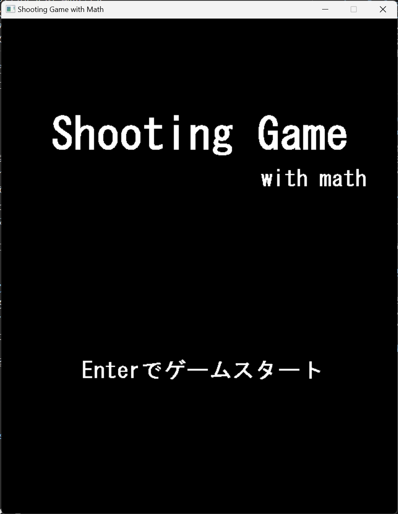
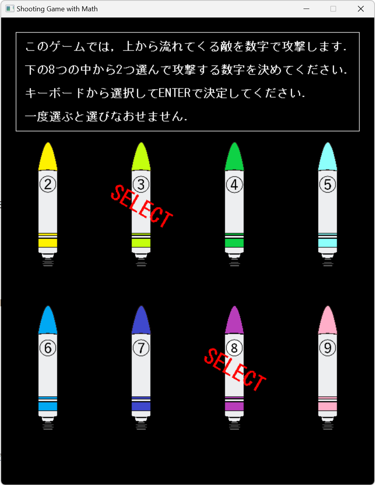
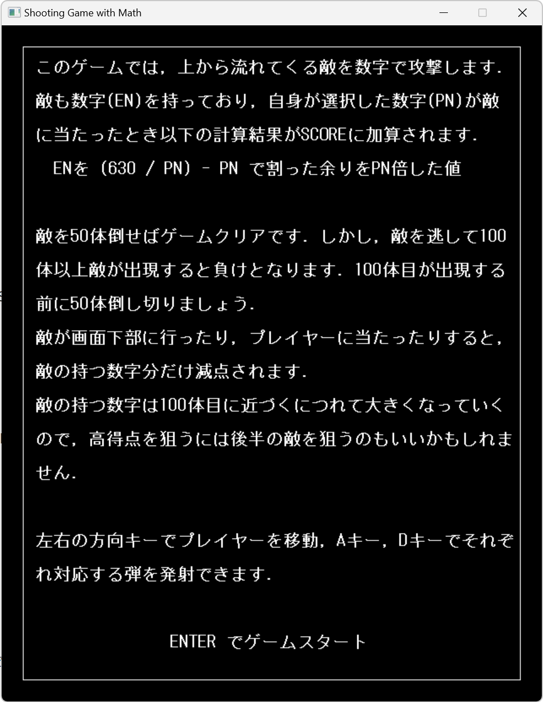
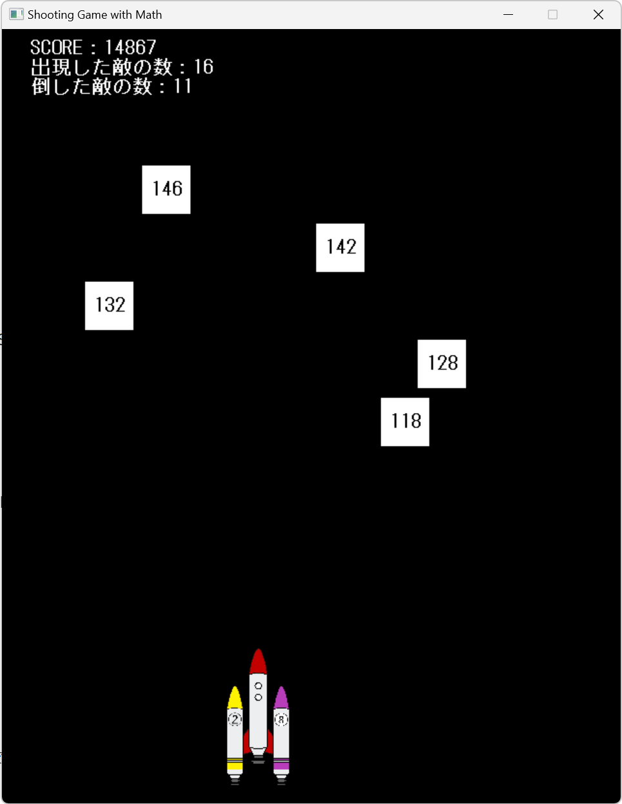
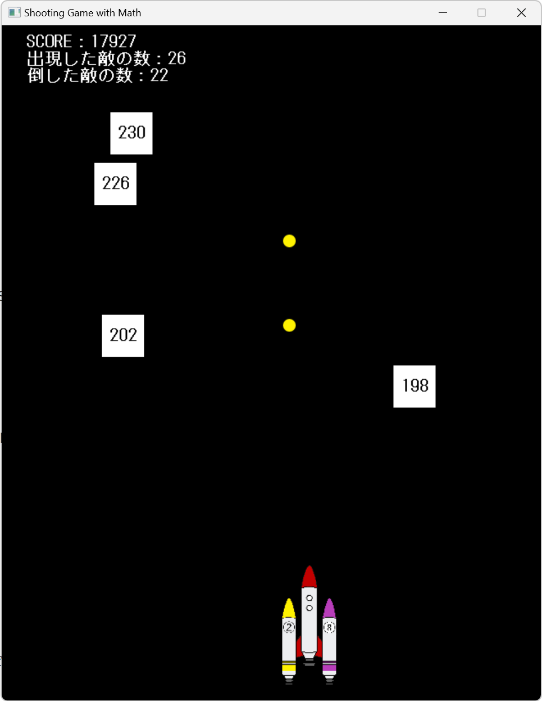
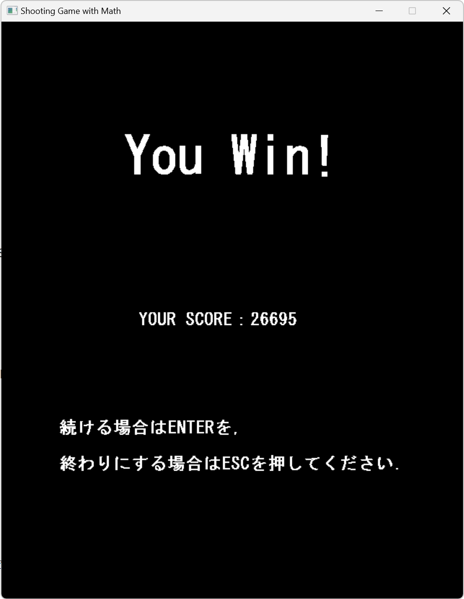

# Shooting Game with Math

## はじめに

このゲームは，上から流れてくる敵を弾を当てて倒すシューティングゲームです．単なるシューティングゲームではつまらないので，頭を使うゲーム，すなわち算数を使うゲームを作りました．全てが1からの勉強だったのでプレイしづらい部分もあると思いますが，楽しんでいただければ幸いです．

## プレイ画面

| スタート画面 | 選択画面 |
| --- | --- |
|  |  |
| 点数計算 | プレイ画面1 |
|  |  |
| プレイ画面2 | 結果画面 |
|  |  |

## 注意事項

本ソフトウェアの著作権は製作者「kage1020」にあります。本ソフトウェアの使用により発生したいかなる障害についても、当方は一切の責任を負わないものとします。

---

また，本ソフトウェアの制作にあたって以下のフリーイラストを使用させていただきました．ありがとうございます．

illust image 様  https://illustimage.com/

## 実行方法

Shooting-game-with-Math.exeを起動する．アンインストールはファイルごと削除するだけです．

## 操作方法

Aキー　 ：左側の弾を発射

Dキー　 ：右側の弾を発射

右方向キー  ：プレイヤーを右に移動

左方向キー　：プレイヤーを左に移動

[Esc]キー 　：ゲーム終了

## 操作の流れ

基本，画面の指示に従って進めてください．

1. タイトル画面	：ENTERキーを押して次の画面へ進んでください．
2. 弾選択画面		：敵を攻撃するのに使う弾を2つ選んでください．
   選ぶ際は，「キーボード」から選択してください．マウスカーソルは反応しません．
3. ルール説明		：得点算出方法など詳しく書いてあるので，詳しくはゲームの方を読んでください．
4. ゲームプレイ	：直観的でわかりやすく作ったつもりですが，理解できなかったら申し訳ありません．
5. 結果画面		：ゲームの結果によって2通りの画面が出てきます．再度弾を選択してゲームをプレイするか，やめるかを選択します．

## 更新履歴

2020/11/19	ver1.0.0 公開
